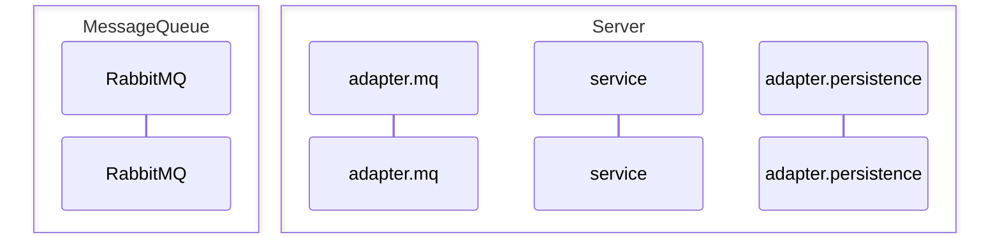

## UseCase 분석

```mermaid
flowchart LR
    A1([키워드 카운트 증가])
    A2([키워드 조회])
```

### 키워드 카운트 증가

```mermaid
sequenceDiagram
    box MessageQueue
        participant RabbitMQ
    end
    box Server
        participant adapter.mq
        participant service
        participant adapter.persistence
    end
    
    
```