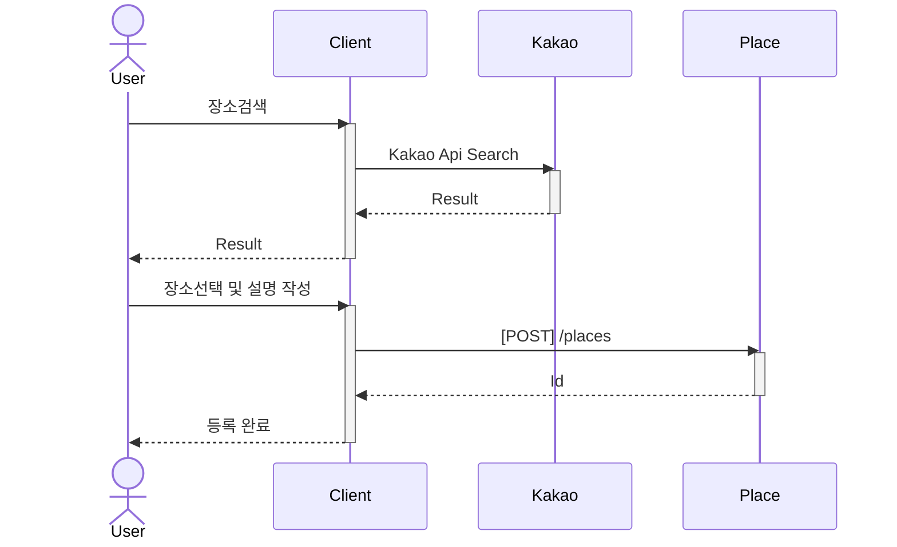
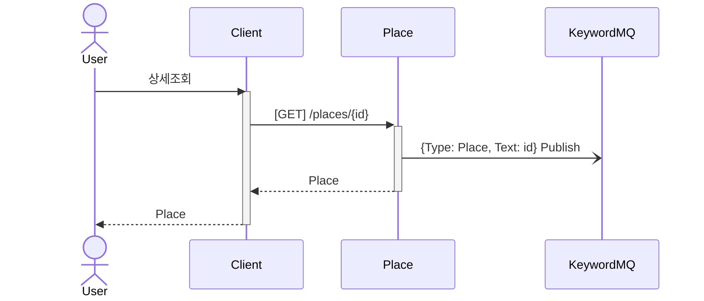

## UseCase 분석

```mermaid
flowchart LR
    A1([장소 등록]) ~~~ A2([장소 수정]) ~~~ A5([장소 리뷰 작성])
    A3([장소 조회]) --- A6([인기 검색 순위 조회])
    A6 --- A8([조회 수])
    A6 --- A9([댓글 수])
    A6 --- A11([별점 평균])
    A3 --- A7([상세 조회]) --- A10([인기 검색 카운트 + 1])
```

### 장소 등록

```mermaid
sequenceDiagram
    actor User
    participant Client
    participant Kakao
    participant Place

    User ->> Client: 장소검색
    activate Client
    Client ->> Kakao: Kakao Api Search
    activate Kakao
    Kakao -->> Client: Result
    deactivate Kakao
    Client -->> User: Result
    deactivate Client

    User ->> Client: 장소선택 및 설명 작성
    activate Client
    Client ->> Place: [POST] /places
    activate Place
    Place -->> Client: Id
    deactivate Place
    Client -->> User: 등록 완료
    deactivate Client
```

### 장소 조회 (상세 조회)

```mermaid
sequenceDiagram
    actor User
    participant Client
    participant Place
    participant KeywordMQ

    User ->> Client: 상세조회
    activate Client
    Client ->>+ Place: [GET] /places/{id}
    Place -) KeywordMQ: {Type: Place, Text: id} Publish
    Place -->>- Client: Place
    Client -->> User: Place
    deactivate Client
```