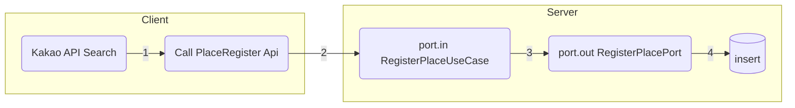
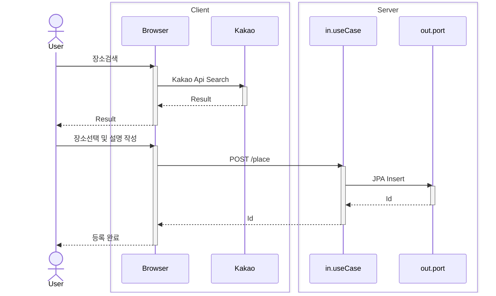
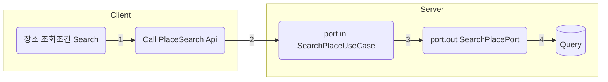

### 장소 등록

```mermaid
flowchart LR
    subgraph Client
        A1("Kakao API Search") -->|1| A2("Call PlaceRegister Api")
    end
    subgraph Server
        A2 -->|2| A'1
        A'1("port.in RegisterPlaceUseCase") -->|3| A'2("port.out RegisterPlacePort") -->|4| A'3[("insert")]
    end
```

```mermaid
sequenceDiagram
    actor User
    box Client
        participant Browser
        participant Kakao
    end
    box Server
        participant in.useCase
        participant out.port
    end

    User ->> Browser: 장소검색

    activate Browser
    Browser ->> Kakao: Kakao Api Search
    activate Kakao
    Kakao -->> Browser: Result
    deactivate Kakao
    Browser -->> User: Result
    deactivate Browser


    User ->> Browser: 장소선택 및 설명 작성
    activate Browser
    Browser ->> in.useCase: POST /place
    activate in.useCase
    in.useCase ->> out.port: JPA Insert
    activate out.port
    out.port -->> in.useCase: Id
    deactivate out.port
    in.useCase -->> Browser: Id
    deactivate in.useCase
    Browser -->> User: 등록 완료
    deactivate Browser
```

### 장소 조회

```mermaid
flowchart LR
    subgraph Client
        A1("장소 조회조건 Search") -->|1| A2("Call PlaceSearch Api")
    end
    subgraph Server
        A2 -->|2| A'1
        A'1("port.in SearchPlaceUseCase") -->|3| A'2("port.out SearchPlacePort") -->|4| A'3[("Query")]
    end
```