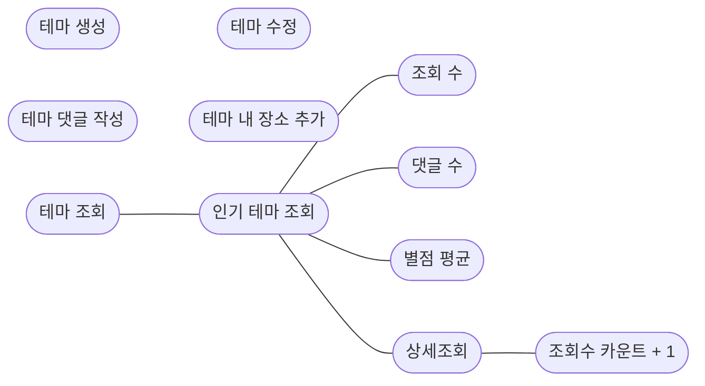

## UseCase

```mermaid
flowchart LR
    A1([테마 생성]) ~~~ A2([테마 수정])
    A3([테마 댓글 작성]) ~~~ A4([테마 내 장소 추가])
    A5([테마 조회]) --- A6([인기 테마 조회])
    A6 --- A7([조회 수])
    A6 --- A8([댓글 수])
    A6 --- A9([별점 평균])
    A6 --- A10([상세조회]) --- A11([조회수 카운트 + 1])
```
